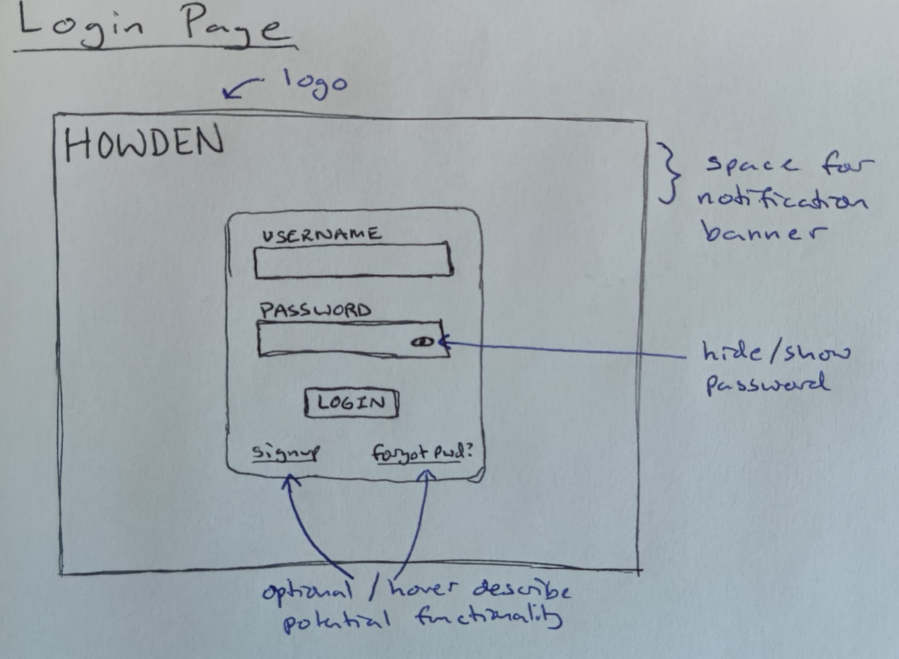
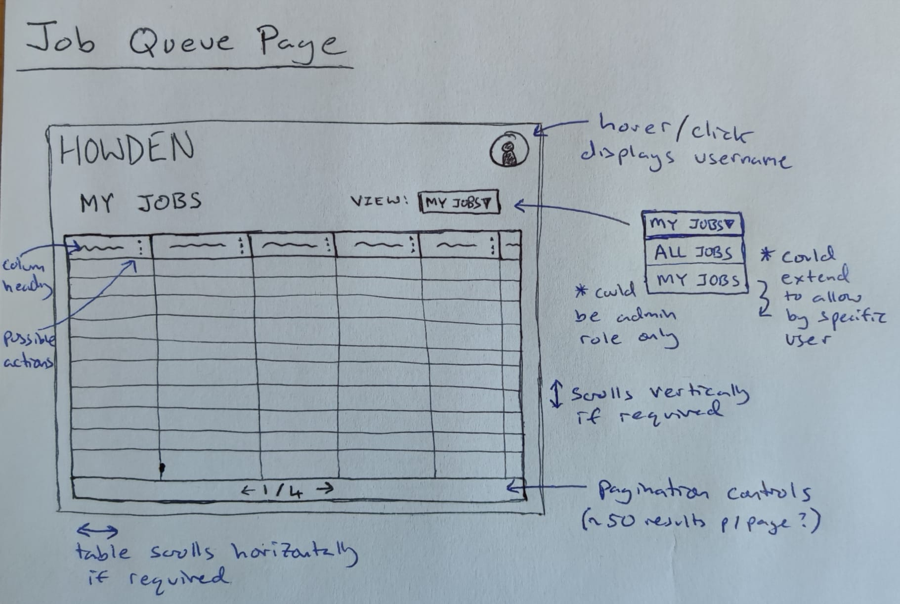
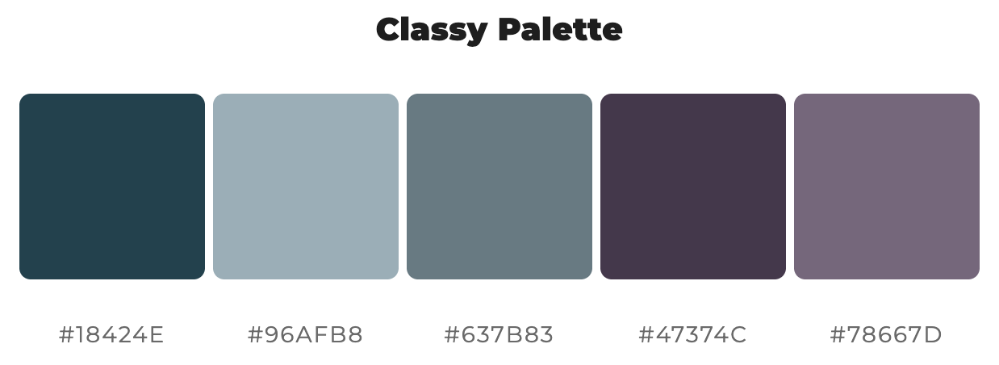

# Job Queue Visualiser

## Running locally

Requirements:
- Python 3.8+
- Node.js and npm

### Steps:
- Pull the repo locally
```
git clone https://github.com/mountaincharlie/job-queue-visualiser.git
cd job-queue-visualiser
```
- Setup and run the backend
    - Mac / Linux
    ```
    cd backend
    python3 -m venv venv  # only required on the first setup
    source venv/bin/activate  # only if the virtual env is not already active
    pip install -r requirements.txt
    uvicorn main:app --reload --port 8000
    ```
    - Windows
    ```
    cd backend
    python3 -m venv venv  # only required on the first setup
    source venv/Scripts/activate  # only if the virtual env is not already active
    pip install -r requirements.txt
    uvicorn main:app --reload --port 8000
    ```
- Setup and run the frontend (from the project root)
```
cd frontend
npm install
npm run dev
```

#### For the frontend, navigate to: `http://localhost:5173/`
#### For API docs, navigate to: `http://localhost:8000/docs`

## Initial UX/UI

### Designs

- Login Page Designs:
- 

- Job Queue Designs:
- 

### Logo

- Borrowed from [HOWDEN Small Business page](https://www.howdeninsurance.co.uk/small-business)
- 

### Fonts

- The basic text font on the HOWDEN pages is a non-free font `Aktiv Grotesk`, which according to [similarfont.io](https://similarfont.io/2-google-fonts-similar-to-aktiv-grotesk) is very similar to Google Font's `Roboto`
- Rather than have a seperate heading and text font, I plan to use UPPERCASE for headings and Capitalization for text

### Colours

- Colour palette example generated on: [mycolor.space](https://mycolor.space/?hex=%2318424E&sub=1)
- I plan to keep to a simple 2 colours scheme pairing the main dark blue with one of the greys 
- 

