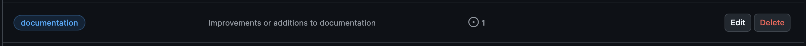
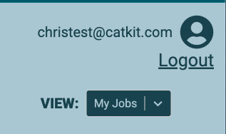

# Job Queue Visualiser

## Running locally:

Requirements:

- Python 3.8+
- npm

### Steps:

- Pull the repo locally

```
git clone https://github.com/mountaincharlie/job-queue-visualiser.git
cd job-queue-visualiser
```

- Setup and run the backend
  - Mac / Linux
  ```
  cd backend
  python3 -m venv venv  # only required on the first setup
  source venv/bin/activate  # only if the virtual env is not already active
  pip install -r requirements.txt
  uvicorn main:app --reload --port 8000
  ```
  - Windows
  ```
  cd backend
  python3 -m venv venv  # only required on the first setup
  source venv/Scripts/activate  # only if the virtual env is not already active
  pip install -r requirements.txt
  uvicorn main:app --reload --port 8000
  ```
- Setup and run the frontend (from the project root)

```
cd frontend
npm install
npm run dev
```

#### For the frontend, navigate to: `http://localhost:5173/`

#### For default FastAPI docs in Swagger, navigate to: `http://localhost:8000/docs`

## Project Management

The requirements for this application were:

- A two page application
  - User login / authentication page
  - Job queue viewing page
- The login page can be a basic user authentication, but the security and improvements for a production / live version should be considered
- By default the job queue page should show the current user's jobs only
- There should be some kind of toggle to allow the user to switch between viewing their own jobs and all the jobs
- A xlsx file was provided to generate the job and user data from
- The data could be displayed in teh table in any reasonable way, but the Details column should include a download button if an output result was available, an error message if one was given or could be left blank

### Project Board

You can find the project board for this repo [here](https://github.com/users/mountaincharlie/projects/5)

### Example Tickets

- Dev task:
  - 
- User Story:
  - 
- Future idea:
  - 

### Labels

- Dev task:
  - 
- Design task:
  - 
- Documentation:
  - 
- User Story:
  - 
- Must have:
  - 
- Could have:
  - 

## Technologies and Main Libraries Used

- Fronted: JavaScript React
  - Material UI Data Grid
  - Axios
  - JWT Decode
  - React Icons
  - Sass
- Backend: Python
  - FastAPI
  - Pandas
  - PyJWT
  - PassLib Bcrypt
  - Pydantic

## Initial UX/UI

### Designs

- Login Page Designs:

  - 

- Job Queue Designs:
  - 

### Logo

- Borrowed from [HOWDEN Small Business page](https://www.howdeninsurance.co.uk/small-business)
  - 

### Fonts

- The basic text font on the HOWDEN pages is a non-free font `Aktiv Grotesk`, which according to [similarfont.io](https://similarfont.io/2-google-fonts-similar-to-aktiv-grotesk) is very similar to Google Font's [Roboto](https://fonts.google.com/specimen/Roboto)
- Rather than have a seperate heading and text font, I plan to use UPPERCASE for headings and Capitalization for text

### Colours

- Colour palette example generated on: [mycolor.space](https://mycolor.space/?hex=%2318424E&sub=1)
- I plan to keep to a simple 2 colours scheme pairing the main dark blue with one of the greys
  - 

## Security Considerations

### Inputs

- User inputs (username and password on Login) have basic restriction to only allow certain characters and a certain length in order to prevent any malicious input being ever submitted.

```
// checks input on type and doesnt allow special character except those required for email
const checkInput = (text, type) => {
if (type === 'username') {
    if (/^[a-zA-Z0-9._@-]*$/.test(text) && text.length < 45) {
    setUsernameInput(text);
    }
}

if (type === 'password') {
    if (/^[a-zA-Z0-9._@-]*$/.test(text) && text.length < 30) {
    setPasswordInput(text);
    }
}
};
```

### Passwords

- On the frontend the password only lives in memory (React state) during the session but is not stored at anypoint and is not hashed on the frontend.
- It is then sent by POST request to the API (this is secure enough on localhost, but on production would require being sent via HTTPS). Sending by POST request rather than GET is safer to avoid details being exposed in the URL.
- The passwords in the `users.xlsx` database are hashed using bcrypt from the PassLib library to avoid storing raw passwords in the database.
- Bcrypt is also used to verify whether the users input password matches the stored password.
- Regardless of which login details are incorrect, the same "Invalid username or password" error message is given to protect which detail is incorrect.

### Environment variables

I chose to use a `.env` file in the `/backend` in order to store:

- `DEFAULT_PASSWORD`: set to be used for all users, for simplicity, in the `/backend/utils/setup_users.py` script which generates the users.xlsx file (used as the users database).
- `JWT_SECRET`: the JSON Web Token secret key used to encode and decode the JWT in `/backend/utils/auth_utils.py`.

### Tokens

- On successfully verifying a user, a Json Web Token is created containing the username, role and token expiry time.
- The token is sent to the frontend and stored in localStorage (this is fine for running locally but should be handled differently on production) in order to persist.
- `getValidToken()` from `/frontend/src/utils/userUtils.jsx` is used to check that the token is still valid at required points (e.g. when making the GET requests for the user's jobs or all jobs, or for accessing the `job-queue` page).
- If the user logs out or the token is found to be invalid (e.g. expired), the token is cleared from localstorage and the users login state is reset.

### Protected Enpoints and Routes

- The `job-queue` route is protected, using a custom component `/frontend/src/utils/ProtectedRoute.jsx` requiring the user's logged in state to be true (see `/frontend/src/contexts/AppContext.jsx`) and their token to be valid.
- Non-authenticated user's trying to access `job-queue` sre redirected to the login page.
- Authenticated users are automatically routed to the `job-queue` page.
- On logging out, users are redirected to the login page.

### Roles

- The dropdown only shows if the user has the 'admin' role since only admin users should be able to view All Jobs, but any user can view their own jobs.
- In addition to the conditional display of the dropdown, the `handleViewDropdownOption()` in `/frontend/src/pages/JobQueue.jsx` only allows the request to be made through the `getAllJobs()` service if the user has the 'admin' role.
- Currently all users have the admin role, but future features for Roles are discussed in the Future Features section.

## Final Designs

The final layout of the two pages remained close to the initial designs as well as the chosen fonts and colours, with the exception of lightening the light grey from #96AFB8 to #a9c7d2 in order to have a better contrast with the default dark blue.

- Login Page:
  - 
- Unsuccessful login:

  - 

- Successful login:

  - 

- My Jobs (default table):

  - 

- All Jobs (on dropdown selection):

  - 

- Dropdown actions available for each columns:

  - 

- Clicking user icon to show Logout option:
  - 

## Future Features

### Workflow Task in Table View

Workflow Task can be included as a column in the table view by incorporating changes to the API:

- Once the `WorkflowTypeID` has been used to identify the `WorkflowType` the `WorkflowStep` can be used in addition to identify the `WorkflowTask` (and its `DependantOn` if provided)
- This would be included in the JSON response sent to the frontend where the values can be formatted to have regular casing and underscores removed

### Security Considerations for Production Version

- The `API_BASE_URL` should be updated and also stored and accessed from the `.env`
- The frontend url should be updated and stored in the `.env` to be used for the allowed_origins for FastAPI
- Users should have secure passwords (not the same default password currently used for simplicity purposes)
- An alternative to `localStorage` should be used to allow authenticated user tokens to persist until expiry. e.g:
  - Cookies: HttpOnly flag ensures client-side JS can't access the cookies, preventing cross-site scripting attacks. Secure flag ensures the token is sent on a secure channel to prevent man-in-the-middle attacks. SameSite flag can help mitigate the risk of cross-site forgery attacks.
  - Also use JSON Web Encryption (JWE) to encrypt JWTs on the server before sending to the client and the encryption keys are kept on the server side.

### Roles

- Users can be assigned 'admin' or 'basic' roles
- Basic users can only view their own jobs
- Admin users can view their own jobs, all jobs and also change the role of other users
  - Admin users cannot change their own role (to protect against there being no admin users)
  - In the case where removing users is a feature, there should be a check before removing admin users to make sure there is at least one other admin user

### User Signup

- A button appearing in the login form on the login page
- Navigates the user to a sign up form which prompts for usernamme, password and password confirmation
  - This form should contain all the validation / input sanitation checks required for logging in
- If the user already exists they're informed in a notification and redirected to the login page with the username pre-filled
- On successful signup the user sees a success notification and is redirected to the login page
  - There should be further checks and requirements on the backend for which kinds of users are allowed to sign up
  - A confirmation email may be sent to the user
- By default new users should have 'non-admin' / 'basic' role
- A new POST request can be made for the `/users` endpoint in the API

### Forgotten Password

- A button appearing in the login form on the login page
- The user enters their email address and a note informs them that they will recieve a forgotten password email if their email is linked to a valid user account
- The user recieves navigation to a new password form which updates their details and then redirects to the login page
  - Creating a new password should contain all the validation / input sanitation checks required for logging in

### Job Creation

Depending on how the jobs are currently being created and whether it would make sense to allow the creation of jobs within the same platform.

- A `New Job` button would be added to trigger a Modal / Popup component or redirect to a new page to create a new job
- The component or page would contain a form with the necessary inputs, selections and validation checks for the user to create a new job
  - Some or all of the options could be restricted by role or other access requirements
  - If the user exits / cancels the form before submission the details will be cleared from the state in the frontend
- The notification and Loading Spinner components can be used for user feedback
- A new POST request can be made for the `/jobs` endpoint in the API
- Once the job is created the user could be navigated back to the job queue where the new job would appear in the table view
